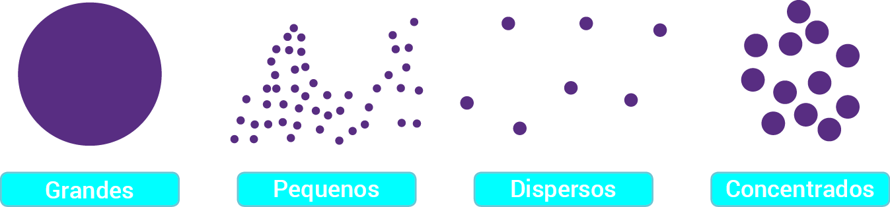
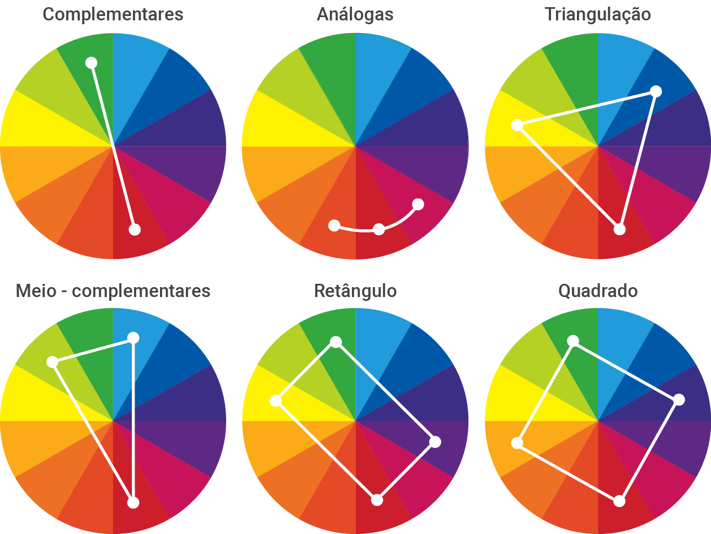

# Forma, composição e Gestalt

## Índice

- [Forma, composição e Gestalt](#forma-composição-e-gestalt)
  - [Índice](#índice)
  - [Forma e composição](#forma-e-composição)
    - [Ponto](#ponto)
    - [Linha](#linha)
    - [Plano](#plano)
    - [Cor](#cor)
    - [Tonalidade](#tonalidade)
    - [Contraste](#contraste)
      - [Contraste de tom](#contraste-de-tom)
      - [Contraste de cor](#contraste-de-cor)
      - [Contraste de forma](#contraste-de-forma)
      - [Contraste de escala](#contraste-de-escala)
    - [Textura](#textura)
    - [Escala (Proporção)](#escala-proporção)
    - [Dimensão (Perspectiva)](#dimensão-perspectiva)
      - [Perspectiva linear](#perspectiva-linear)
      - [Perspectiva tonal (atmosférica)](#perspectiva-tonal-atmosférica)
  - [Elementos relacionais (intelectuais) da composição visual](#elementos-relacionais-intelectuais-da-composição-visual)
    - [Forma e contraforma](#forma-e-contraforma)
    - [Peso](#peso)
  - [Direção, movimento e ritmo](#direção-movimento-e-ritmo)
    - [Direção](#direção)
    - [Movimento](#movimento)
    - [Ritmo](#ritmo)
  - [Gestalt (psicologia da percepção)](#gestalt-psicologia-da-percepção)
  - [Princípios básicos que regem as forças internas de organização](#princípios-básicos-que-regem-as-forças-internas-de-organização)
  - [Oito leis da Gestalt](#oito-leis-da-gestalt)
    - [1) Lei da Pregnância da Forma (Princípio da boa forma)](#1-lei-da-pregnância-da-forma-princípio-da-boa-forma)
    - [2) Lei da Unidade](#2-lei-da-unidade)
    - [3) Lei da Segregação](#3-lei-da-segregação)
    - [4) Lei da Unificação](#4-lei-da-unificação)
    - [5) Lei do Fechamento](#5-lei-do-fechamento)
    - [6) Lei da Continuidade](#6-lei-da-continuidade)
    - [7) Lei da Proximidade](#7-lei-da-proximidade)
    - [8) Lei da Semelhança](#8-lei-da-semelhança)

## Forma e composição

- `Composição visual` é a combinação de elementos que são arranjados de uma maneira que cria um todo.
- A `composição` é a maneira como os elementos são dispostos.
- O resultado de uma `composição visual` será definido pela articulação dos **elementos formais primordiais** (`ponto`, `linha` e `plano`) e **demais elementos formais** (`cor`, `tonalidade`, `contraste`, `textura`, `escala`, `dimensão`, `proporção` e `movimento`) dentro de um **determinado espaço ou suporte visual**.

### Ponto

- Mais básica e irredutível forma de expressão visual.

### Linha

- Pode ser definida como um ponto em movimento.
- É constituída por um conjunto de pontos.

### Plano

- Se origina de uma linha que se fecha, ou do encontro de linhas que formam espaços entre si.

### Cor

- Cores possuem o poder de influenciar o comportamento humano, provocando sensações e emoções.

### Tonalidade

- Fenômeno que ocorre devido as superfícies que possuem propriedades de absorver ou refletir as variações de luz, dessa forma promovem as variações tonais.

### Contraste

- Ressalta, enfatiza ou intensifica um significado.

#### Contraste de tom

- Relação entre claro e escuro.
- `Alto contraste`: Grande diferença entre as cores. **Exemplo:** Preto e branco.
- `Baixo contraste/Semitom` Pequena diferença entre as cores. **Exemplo:** Gradações de cinza.

#### Contraste de cor

- Relação entre cores distintas.
- **Ápice:** Quando uma cor envolve completamente a outra.
- Todas cores envolvidas são afetadas.
- **Tipos:** Contraste `de cor em si`, `claro-escuro`, `quente-frio`, `de cores complementares`, `simultâneo`, `sucessivo` e `de qualidade`.

#### Contraste de forma

- Relação entre formas distintas.
- Uma forma simples afetada por outra que é irregular e imprevisível.
- Evidencia, destaca e aguça, com um efeito impactante e dramático.

#### Contraste de escala

- Utilização de elementos destoantes das escalas/proporções reais.
- Torna necessário assimilar a ilusão intencional do artista ao invés da expectativa baseada na realidade.

### Textura

- Representa e substitui o `tato`.
- Sua natureza pode ser `tátil` ou `ótica`.
- `Geométrica`: Dispostas conforme um padrão dentro de uma área ou superfície, e ocorre pelo agrupamento de elementos semelhantes visualmente muito próximos. **Exemplo:** Linhas, pontos, formas geométricas.
- `Orgânica`: Superfície possui uma aparência de algo natural, parecendo que pode ser percebida pelo toque. **Exemplo:** Tijolos, madeira, pedras, pele, etc.

### Escala (Proporção)

- Relação entre o tamanho de elementos visuais em uma composição, ou entre a composição e o espaço que a contém.

### Dimensão (Perspectiva)

- Ilusão de profundidade (tridimensionalidade).
- O objetivo é retratar as distâncias entre os elementos do desenho e entre o desenho e o observador.

#### Perspectiva linear

- Representação do 3D no 2D, através de linhas retas que convergem para um ou mais pontos de fuga.

#### Perspectiva tonal (atmosférica)

- Representação do 3D no 2D, através cores e tonalidades que representam a influência da luz sobre os elementos.

## Elementos relacionais (intelectuais) da composição visual

### Forma e contraforma

- `Forma`: Figura ou imagem visível do conteúdo, plano principal de uma composição.
- `Contraforma`: Espaço vazio que envolve a forma, plano secundário de uma composição.

### Peso

- Sensação psicológica de que um elemento visual é mais importante que outro.
- `Localização`: Um elemento estar centralizado, por exemplo, pode aumentar ou diminuir o seu peso.
- `Tamanho`: Um elemento maior pode ser mais importante que um menor.
- `Perspectiva`: Um elemento próximo pode ser mais importante que um distante.
- `Claridade visual`, `contraste` ou `tratamento superficial`: Um elemento mais claro ou com contraste pode ser mais importante que um mais escuro.

## Direção, movimento e ritmo

### Direção

- Todas formas básicas expressam três direções: `horizontal e vertical (quadrado)`, `diagonal (triângulo)` e `circular (círculo)`.
- `Horizontal`: êxtase, calma.
- `Vertical`: prontidão, equilíbrio.
- `Inclinada`: instabilidade, atividade.
- `Curva`: continuidade, totalidade.

### Movimento

- Os elementos presentes em uma composição podem produzir a ilusão de movimento.

### Ritmo

- Geralmente anda em conjunto com o movimento.
- Expressão de movimento dada pela repetição (ou expectativa dessa repetição) de um determinado elemento em uma composição visual.
- Conduz o olhar do espectador, estimula a percepção em uma direção sugerida.

## Gestalt (psicologia da percepção)

- **Teoricamente:** É uma escola de Psicologia experimental que teve como seu precursor Von Ehrenfels, filósofo vienense de fins do século XIX.
- **Gestaltismo:** Movimento de 1910 - Universidade de Frankfurt, com o objetivo de conhecer melhor a mente humana.
- Atuação no campo de `teoria da forma`, estudos de `percepção`, `linguagem`, `inteligência`, `aprendizagem`, `memória`, `motivação`, `conduta exploratória` e `dinâmica de grupos sociais`.
- `Gestalt`: Significa, em alemão, forma, figura, aparência, etc.
- Estudo de como as pessoas se atraem pela imagem (o que hoje chamamos de `design`).
- Propõe que o cérebro percebe, interpreta e incorpora uma imagem ou ideia, quando nos damos conta de seu todo, e não elementos isolados.

## Princípios básicos que regem as forças internas de organização

- As forças iniciais mais simples que regem o processo da percepção da forma visual são as forças da segregação e unificação.
- Em `Gestalt`:
  - `Forças da unificação`: Agem em virtude da igualdade de estimulação, ou seja, quando os elementos são iguais, o cérebro tende a unificá-los.
  - `Forças da segregação`: Agem em virtude da desigualdade de estimulação, ou seja, quando os elementos são diferentes, o cérebro tende a segregá-los.
- Para que se formem unidades, é necessário que haja descontinuidade de estimulação, contraste.
- Se houver uma estimulação homogênea, sem contrastes, o cérebro não consegue perceber a forma.

## Oito leis da Gestalt

### 1) Lei da Pregnância da Forma (Princípio da boa forma)

- Princípio básico da percepção visual da Gestalt.
- A pregnância da forma diz que a construção da forma deve possuir uma estrutura simples, equilibrada, homogênea e regular.
- Conforme uma forma apresente harmonia, unificação, clareza e um mínimo de complicação visual em sua organização, maior será o nível de facilidade que teremos para identificá-la e compreendê-la visualmente.

### 2) Lei da Unidade

- Complementa a lei da Pregnância.
- Capacidade que temos de compreender um determinado elemento como um todo agregado, mesmo que ele seja composto de várias outras partes, ainda que as partes apresentem espaços vazios que serão preenchidos pela mente.
- É essencial na criação ao permitir a organização e disposição de elementos que, por sua vez, possuam suas unidades previamente existentes.

### 3) Lei da Segregação

- Capacidade do cérebro de distinguir, diferenciar ou evidenciar objetos, ainda que estejam sobrepostos.
- Se deve às características e peculiaridades de cada objeto que permitem discriminar variações de ordem formal e estética em comparação com outro.
- Dessa maneira, os estímulos visuais de cada unidade também serão diferentes.
- A segregação ocorre de várias maneiras: pontos, linhas, planos, volumes, sombras, brilhos, texturas, relevos, entre outras formas.

### 4) Lei da Unificação

- Capacidade de agrupar elementos distintos.
- Trata da nossa propensão a interpretar certos elementos como sendo de um mesmo grupo, seja por proximidade ou semelhança de estímulos.
- Nos faz perceber unidades complexas, compostas de vários elementos.

### 5) Lei do Fechamento

- Nosso cérebro tem a tendência natural de fechar ou concluir formas aparentemente inacabadas ou abertas.
- Decorre da existência de padrões sensoriais e de ordem espacial que temos em nossa mente.
- Na intenção de estabelecer a continuidade de uma forma, prevemos toda a sua estrutura.

### 6) Lei da Continuidade

- Fluidez de uma forma.
- Impressão visual de como as partes se sucedem através da organização perceptiva da forma de modo coerente sem interrupções.
- Trata-se da tendência dos objetos e formas em seguir uma linha de fluidez visual gradativa.
- Pode ser através de formas, linhas, cores, profundidade, planos etc.
- Quando se enxerga os elementos em uma composição numa sequência harmoniosa, de modo ininterrupto, pode-se dizer que essa peça tem uma boa continuidade.

### 7) Lei da Proximidade

- Elementos muito próximos que se encaixem de forma harmoniosa são processados em nosso cérebro como um conjunto de elementos ou unidades.
- Quando unida à semelhança, essa capacidade dá interpretação visual, que tende a unificar elementos próximos, fica ainda mais forte e facilita a interpretação da forma.

### 8) Lei da Semelhança

- Prevê que elementos que apresentam características visuais idênticas ou semelhantes tendem a ser agrupados pelo cérebro entre si, formando uma unidade, conforme uma mesma família.
- O fundamento proposto pela Lei da Semelhança é comumente utilizado para criar formas a partir de outras formas.
