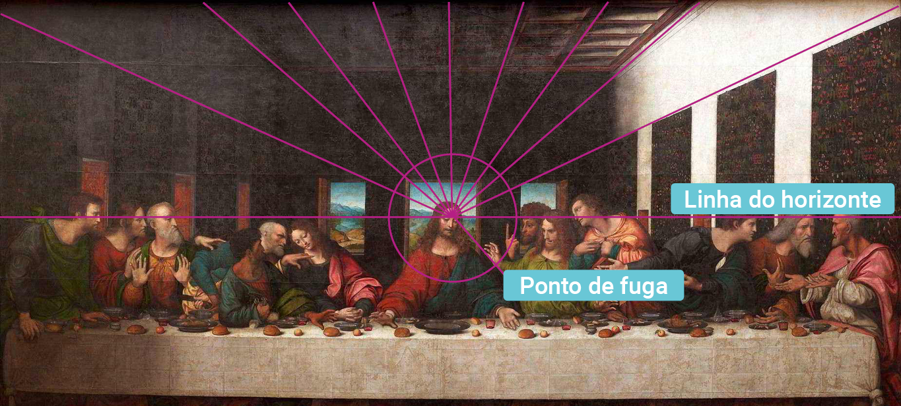

<!-- markdownlint-disable MD033 -->
# Perspectiva

- A perspectiva corresponde a como o ser humano apreende visualmente seu ambiente e o transfere a outro suporte, seja aplicando a projetos técnicos ou artísticos.
- É o método que permite a representação de objetos tridimensionais (altura, largura e profundidade) em superfícies bidimensionais, através de determinadas regras geométricas de projeção.

## Índice

- [Perspectiva](#perspectiva)
  - [Índice](#índice)
  - [Axonométricas (isometria, dimetria e trimetria)](#axonométricas-isometria-dimetria-e-trimetria)
    - [Isometria](#isometria)
    - [Dimetria](#dimetria)
    - [Trimetria](#trimetria)
  - [Gabinete, cavaleira e militar](#gabinete-cavaleira-e-militar)
  - [Perspectiva linear (cônica / ponto de fuga)](#perspectiva-linear-cônica--ponto-de-fuga)
    - [1 ponto de fuga](#1-ponto-de-fuga)
      - [Curiosidade](#curiosidade)
      - [Breve história da perspectiva](#breve-história-da-perspectiva)
    - [2 pontos de fuga](#2-pontos-de-fuga)
    - [3 pontos de fuga](#3-pontos-de-fuga)
  - [Perspectiva aérea (atmosférica)](#perspectiva-aérea-atmosférica)
  - [Perspectiva hierárquica](#perspectiva-hierárquica)
    - [O sumiço da perspectiva nos desenhos durante a Idade Média](#o-sumiço-da-perspectiva-nos-desenhos-durante-a-idade-média)

## Axonométricas (isometria, dimetria e trimetria)

- `Axonometria` é o desenho `paraline` de uma projeção `axonométrica`, em que todas as linhas paralelas aos três eixos principais são traçadas em escala, enquanto as linhas diagonais e curvas são distorcidas.
- Usada em desenhos técnicos, arquitetônicos e industriais.
- É uma projeção cilíndrica ortogonal sobre um plano oblíquo em relação às três dimensões do corpo que será desenhado.
- Permite alterar a posição do observador ao rotacionar os eixos e, assim, gerar diversas combinações de visualização do projeto para satisfazer qualquer dúvida do construtor ou cliente.

### Isometria

- Situação onde os três eixos (x, y e z) estão separados por 120 graus. As faces principais estão inclinadas igualmente em direção ao quadro, de modo que seus três eixos principais são escorçados na mesma proporção.

Embasamento visual

### Dimetria

- Quando dois ângulos são iguais e o terceiro aparece mais longo ou mais curto que os dois.

Embasamento visual

### Trimetria

- Quando as distâncias entre os eixos possuem ângulos distintos, ou seja, os três eixos principais são escorçados em ângulos diferentes.

Embasamento visual

## Gabinete, cavaleira e militar

- `Cavaleira`: Nela, a projeção cilíndrica oblíqua tem uma das faces paralela ao plano de projeção.
- Por exemplo, a projeção ortogonal de um círculo será uma elipse.
- Quem vê a perspectiva tem a sensação de possuir uma visão de “olho-de-pássaro” sobre o terreno representado.
- Os termos `cavaleria`, `gabinete` e `militar` são de perspectivas bastante utilizadas para projetar topografia de terreno em mapas destinados a fins de estratégia militar, quando se colocava a face paralela ao plano de quadro perpendicular ao plano do solo.

Embasamento visual

## Perspectiva linear (cônica / ponto de fuga)

### 1 ponto de fuga

- O artista representa um objeto ou uma paisagem tridimensional projetando-o sobre um plano a partir de um ponto, o ponto de fuga, que se encontra sobre a linha de horizonte.
- Todas as linhas de projeção do desenho convergem para esse ponto, que, apesar de poder não estar representado, tem uma relevante presença na estrutura da obra.
- Os elementos mais distantes do olho são os que se encontram mais próximos do eixo de visão e do ponto de fuga.
- O `Ponto de fuga` é um ponto imaginário de onde as linhas de fuga se originam e se afastam em direção aos planos mais próximos do observador.
- As `linhas de fuga` são as linhas imaginárias que descrevem o efeito da perspectiva convergindo para o ponto de fuga. É o afunilamento dessas linhas em direção ao ponto que geram a sensação visual de profundidade das faces em escorço dos objetos em perspectiva.
- A `linha do horizonte (LH)`, sempre se apresenta na altura dos olhos. É por ela que o ponto de fuga corre. Abaixado, sentado ou em pé, a LH sempre permanecerá na altura dos olhos.
- Quando a LH não for tão visível, ao contrário da linha que separa o céu do mar, para facilitar sua identificação, coloque um lápis na posição horizontal em frente aos seus olhos, mantendo o pescoço ereto sem levantar nem abaixar a cabeça. Todas as linhas paralelas entre si e que se afastam em direção ao horizonte apresentarão este “ponto de fuga” sobre o horizonte, e todos estes pontos poderão ser representados no `Plano de Quadro`.
- O `ponto de fuga` também pode ficar fora do `Plano de Quadro`.
- O `ponto de fuga` sempre corre pela `LH`, nunca fora dela, quando se utiliza 1 ponto de fuga. Ao não fazer isso, a perspectiva fica incorreta.
- Os planos paralelos ao observador (`Plano de Quadro`) sempre permanecem pararelos à `LH`, enquanto os planos que seguem para o horizonte respeitam a angulação das `linhas de fuga`.

Aspectos técnicos

Exemplos

#### Curiosidade

- **Masaccio (1401-1428)** foi um pintor do início do `Renascimento` italiano em **Florença**, trabalhando ao lado de nomes como **Brunelleschi** e **Donatello**, sendo um dos responsáveis pelo rompimento gradual com o `estilo gótico internacional`, cujos antecessores remontam a **Giotto**.
- Dentre suas grandes obras, para esse momento, destaca-se o `afresco` da `Trindade`, em **Santa Maria Novella**, em **Florença**, realizada por volta de 1427.
- Trata-se de uma representação em `perspectiva ilusionista` de uma capela lateral, pintada em `afresco` na nave lateral esquerda da igreja.
- Relacionando a `perspectiva` com o `Renascimento`, a sua obra `Trindade` é um tributo à **racionalidade**, com sua `simetria` e `ordem austera`.
- As duas figuras ajoelhadas orando, dos dois patrocinadores, formam a base de um `triângulo` que se fecha no topo da composição.
- Outros `triângulos` podem ser traçados a partir das cabeças dos personagens de **Jesus**, **Maria** e **João**.
- O `ponto de fuga` da composição localiza-se nos pés da **Cruz de Cristo**, sendo o ponto de vista do `espectador`, colocando-o como um participante da cena.

Embasamento visual

#### Breve história da perspectiva

- Os antigos povos gregos já possuíam alguma noção do fenômeno `perspéctivo`, denominando-o como `“escorço”`, onde encontramos esforços de aproximação à problemática da representação do tridimensional no bidimensional.
- Entre todos os povos cujas manifestações artísticas podem ser consideradas pré-perspécticas, os **gregos** (e os **romanos**, em evolução à arte grega) são aqueles que mais próximo chegaram da perspectiva: em suas pinturas eles adotavam um método conhecido como escorço (que poderia ser definido como uma `falsa perspectiva`), ou `perspectiva espinha-de-peixe`.
- Os **gregos** não conheciam o `ponto de fuga`, mas o `escorço` produzia resultados próximos do da `perspectiva` e com razoável **ilusão de profundidade**.
- Na **Roma antiga**, podemos ver no `Quarto Estilo de pintura` os exemplos mais belos de perspectivas romanas da Antiguidade Clássica.
- Foi durante o período do **Renascimento** que a `perspectiva` foi descrita.
- **Filipio Brunelleschi** foi um dos célebres arquitetos da `Renascença` que se dedicou aos estudos matemáticos da `perspectiva linear` e, ao lado do contemporâneo artista **Masaccio**.
- **Brunelleschi**, desenvolveu os seus estudos sobre a perspectiva com o objetivo de aplicação aos planos arquitetônicos.
- **Leon Battista Alberti**, teórico e profissional da arquitetura, pintura e escultura, é mais conhecido pela sua obra arquitetônica, contudo é frequentemente considerado como o autor das primeiras formulações sobre as `leis da perspectiva`.
- Para esses artistas e arquitetos renascentistas, a `perspectiva` é `harmonia`, o produto de uma racionalidade superior e divina que confirma o acordo perfeito entre o homem e a natureza.
- Essa característica passou a se tornar recorrente na arte do `Quatrocento`, não apenas a `perspectiva` tornava-se uma maneira de demonstrar profundidade como também ela passou a ser um novo `método compositivo`.
- As pinturas passaram a apresentar uma cena única, coerente, ao invés de uma combinação de situações diversas.

### 2 pontos de fuga

- A `perspectiva` permite criar sensação de `profundidade` e `volume`, mas é possível aumentar ainda mais essa sensação e a visão dos outros lados com a utilização de mais `pontos de fuga`.
- Para maior ideia de `profundidade`, os dois planos dos objetos vísíveis seguirão os planos das `linhas de fuga`, respeitando as suas respectivas angulações.
- Agora, desta posição, somente as `linhas verticais` mantêm-se como tais e `paralelas` entre si, o resto foge em direção ao **horizonte** formando duas séries de linhas em `profundidade` e reunindo-se cada série em seu `ponto`.

Embasamento visual

### 3 pontos de fuga

- Existem **três** conjuntos de `linhas de fuga` e `três pontos de fuga`.
- Nem as verticais nem as horizontais se mantêm `paralelas`.
- Todas as `linhas` seguem ordenadamente para os seus respectivos `pontos de fuga`.
- **Dois** desses `pontos de fuga` se mantêm na `LH`, porém o `terceiro ponto de fuga` sai dessa norma, ocupando um lugar acima ou abaixo da `LH`.

Embasamento visual

## Perspectiva aérea (atmosférica)

- Joga com variações de `luz` e `cor`.
- De forma a obter uma ilusão de `profundidade`, o artista emprega **cores mais luminosas**, **contornos mais nítidos** e **textura mais espessa** nos objetos mais próximos, sendo os mais afastados – que na tela são colocados mais **acima** – pintados com **menos nitidez** e normalmente com cores semelhantes às aplicadas no fundo.
- Isto porque a atmosfera terrestre, que contém poeira e umidade, se interpõe e afeta a luminosidade dos objetos.
- **Leonardo da Vinci** construiu seu entendimento da perspectiva não apenas através da rígida formulação da `perspectiva linear`, mas também compreendendo a `perspectiva` levando em consideração o `ar` (ou a `atmosfera`) presente entre o observador e o objeto observado.
- Ele acreditava que não apenas o `tamanho`, mas também a `aparência` dos objetos mudava à medida que a distância entre objeto e observador aumentava.
- Da mesma forma, as `linhas` que delimitam a `silhueta` do objeto passariam a se tornar **menos distintas** com aquela distância.
- Esses dois elementos (`atmosfera` e `bordas` dos objetos) tornaram-se fundamentais na construção de sua `perspectiva`.
- Tal forma de entender a `perspectiva` veio, inclusive, a ser conhecida como `perspectiva atmosférica`.
- Na **Monalisa**, **Leonardo da Vinci** afasta as montanhas em último plano através da `perspectiva atmosférica`, criando um efeito esfumaçado suprimindo os detalhes ao fundo e realçando-os no `primeiro plano`.
- Em uma das diversas interpretações do quadro, as montanhas representam o mundo medieval encoberto por misticismo e ignorância em contraposição à figura da mulher, representada em seus mínimos detalhes e iluminada pela racionalidade **renascentista**.
- O homem **renascentista** tinha a consciência de seu lugar no `tempo` e `espaço`.
- O pintor inglês **Willian Turner** foi um dos grandes adeptos da `perspectiva atmosférica`, onde explorou com muita intensidade os `efeitos luminosos` na pintura.
- As obras de **Turner** são excelentes exemplos da `perspectiva atmosférica`.

Embasamento visual

## Perspectiva hierárquica

- Representação bidimensional.
- O desenho do espaço é mais simbólico que sensível e as figuras, como acontecia entre os egípcios, obedecem à chamada convenção da perspectiva hierárquica: as figuras mais importantes são representadas em tamanho maior.
- No grupo, a disposição e tamanho das figuras é proporcional à importância de cada uma.

Embasamento visual

### O sumiço da perspectiva nos desenhos durante a Idade Média

- Durante o **período medieval**, não só a técnica representativa da `perspectiva` se perdeu, mas também a visão de mundo dos indivíduos alterou-se, de forma que grande parte do conhecimento teórico a respeito do assunto se perdeu junto.
- O interesse em representar o mundo **espiritual**, e não o **natural**, levou os artistas a utilizarem a `perspectiva hierárquica`.
- Antes do surgimento da `perspectiva linear renascentista`, as pinturas e desenhos normalmente utilizavam uma escala para objetos e personagens de acordo com seu valor espiritual ou temático.
- Em uma pintura egípcia, por exemplo, o faraó certamente era representado em tamanho várias vezes maior que o de seus súditos.
- Especialmente na `arte medieval`, a arte era entendida como um conjunto de símbolos (paisagem de símbolos), mais do que como um conjunto coerente.
- O único método utilizado para se representar a distância entre objetos era pela sobreposição de personagens.
- Os jardins, tema recorrente na `arte medieval`, representavam um refúgio organizado por mãos humanas através da intervenção divina.
- O mundo natural ainda é perturbador, mas o homem já pode criar um universo fechado e tranquilo.
- O poeta florentino **Petrarca** é o primeiro artista a se libertar do “jardim” e gozar a vida campestre fora dos muros das cidades como fonte de felicidade e poesia, fazendo anotações e poemas sobre a natureza, mas ainda com uma certa culpa medieval “por admirar coisas terrenas”.
