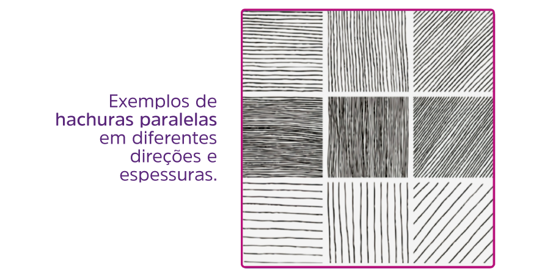

<!-- markdownlint-disable MD033 -->
# Desenho de observação

## Escrevendo a realidade observada

- Aprender a desenhar depende essencialmente da prática da **observação** – desenhe portanto quanto puder, e utilize continuamente os seus olhos (HUNTLY, 1980. p. 4).
- O desenho começa no instante em que a imagem é processada na consciência.
- Quando a luz é filtrada pelos olhos e alcança o cérebro, produz-se a imagem mental, também chamada de **imaginação** (imagem + ação).
- Sendo assim, o desenho será uma consequência da ação de captar e traduzir a imagem mental que temos de algo. Para isso é necessário compreender o que se vê.
- No caso do `desenho de observação`, é preciso primeiramente desenvolver as habilidades de leitura da realidade observada para, posteriormente, proceder ao registro.
- **De forma prática:** O desenho começa na observação, e não no desenho.
- **Enxerga bem, mas não desenha bem:** A observação pressupõe que a atenção estará direcionada para algo específico, na intenção de analisar, investigar, compreender e considerar o objeto que se vê.
- Portanto, desenhar é uma habilidade que se desenvolve e, nesse caso, excede o ato de enxergar.

### Como a observação no desenho vai além de enxergar

- Como algumas habilidades globais – por exemplo, ler, dirigir, esquiar e andar-, desenhar compõe-se de outras habilidades parciais que se integram numa habilidade total.
- Uma vez aprendidas e integrados os componentes, você conseguirá desenhar – assim como uma vez aprendida a habilidade de ler, sabe-se ler por toda a vida; uma vez que se aprende a andar, sabe-se andar por toda a vida.
- Não é preciso continuar acrescentando habilidade básicas eternamente.
- O progresso se dá com a prática, o refino e a técnica.
- A habilidade global para desenhar um objeto, uma pessoa ou um cenário percebido (algo que se vê “de longe”) exige somente cinco componentes básicos, nada mais.
- Estes componentes não são técnicas de desenho em si. São capacidades de perceber:
  - **Um:** percepção das bordas;
  - **Dois:** percepção dos espaços;
  - **Três:** percepção dos relacionamentos;
  - **Quatro:** percepção da luzes e sombras;
  - **Cinco:** percepção do todo, ou gestalt.
- A prática dessas habilidades tendem a desenvolver uma automatização da percepção espacial e, tão logo estejam desenvolvidas, passam a atuar de forma natural na percepção daquele que desenha.

### Importância do desenho de observação na expressão visual

- O desenho de observação é sobretudo um meio para se adquirir o domínio sobre os fundamentos do desenho (que não são regras), sobre a percepção visual e sobre o espaço no qual se desenvolve a obra de arte, seja ela bi ou tridimensional, e leva-nos a conhecer todos os elementos que compõem a linguagem gráfica (HALLAWELL, 2006. p. 9).

## Enquadramento

- O `enquadramento` é a primeira ideia que devemos ter acerca da representação visual.
- Fazer um enquadramento implica estabelecer relações de proporcionalidade e composição.

### Enquadrando com as mãos

- Usar as mãos para fazer um enquadramento é uma forma simples de se ter uma noção de proporção e de espaço.

### Enquadrando com um visor

- Um `visor` é um instrumento que permite enquadrar uma imagem, como uma moldura.

### Enquadrando com um visor com grid

- Fixar um filme transparente de acetato e traçar linhas de referência na moldura.

### Enquadramento com o lápis

- Usar o lápis como referência para as medidas.

## Esboço

- É por meio dele que se inicia a tradução da realidade observada para a superfície do papel.
- Todo desenho de observação acabado será uma consequência dessa relação dialógica entre o que vemos, como vemos e como registramos.
- Assim, durante todo o processo, o desenho é construído, ajustado e alterado até que alcance a satisfação no entendimento do artista.
- Por tratar de uma sucessão de registros que conformam a representação, é recomendável que o esboço seja feito com leveza, simplicidade e espontaneidade, a fim de evitar marcações excessivas que confundam ou comprometam o `acabamento`.

### Composição básica

- Diz respeito à maneira pela qual são arranjados e organizados os elementos de um desenho dentro do espaço da representação.
- Na composição básica, usa-se pontos, linhas e figuras geométricas para representar os elementos do desenho.

### Forma e contraforma

- Usando um lápis, por exemplo, é possível criar uma linha imaginária englobando os elementos observados, e assim, perceber os contornos mais facilmente.

### Perspectiva linear

- Usando o lápis novamente, ou outra referência, tentar identificar a perspectiva observada pra facilitar o desenho.

### Formas circulares e cilíndricas, formas complexas e orgânicas

- Praticamente igual aos métodos descritos anteriormente.
- Entretanto, nesse caso, o pensamento estará voltado para a compreensão e representação do volume das formas e não somente para a área e/ou seu contorno na representação no conjunto.

## Acabamento

- Passa de linhas e grafismos para uma tradução da complexidade da realidade observada, revelada pela luz, com formas, volumes, luz, sombras, tons e texturas.
- A `luz` e a `sombra` adicionam `volume` ao **desenho bidimensional**.

### Luz e sombra

### Texturas e hachuras

- Uma `textura` revela a aparência exterior das superfícies de um determinado objeto ou coisa.
- Elas apresentam as variações da `altura`, `aspereza` ou `polidez`, assim como a configuração geral de uma determinada superfície.
- Cada matéria tem sua própria `textura`, o que a torna diferente das outras.
- Na realização de um desenho realista, a `textura` será concebida por meio de uma representação abstrata derivada de um `padrão` percebido.
- Esse `padrão`, por sua vez, diz respeito a uma repetição contínua de determinadas características físicas do objeto.
- Elas podem ser representadas, por exemplo, por pontos repetidos, hachuras (linhas paralelas dispostas em um determinado sentido), variações de pressão sobre o material traçante, uso de boleador ou ponta seca (produzindo sulcos e demarcações sobre a superfície virgem do papel), misturas e sobreposições de linhas, cores e manchas, etc.

Padronagens e hachureamentos

### Aplicação do princípio gradiente, subtrativo e tonal

- Em linhas gerais, o processo global de aplicação de cores, luzes e sombras para desenhos realistas sobre papel pode seguir o princípio `gradiente`, `subtrativo` e `tonal`.
  - `Gradiente` por ser concebido em etapas sucessivas.
  - `Subtrativo` por diminuir a luminosidade do suporte (papel) à medida que recebe pigmento.
  - `Tonal` por tratar da diferenciação de tons, à medida em que se observa a realidade representada.

#### Em representações monotonais

- **Branco:** preserve as áreas que eventualmente refletem a luz e, desse modo, utilize o branco do papel. No caso de papéis coloridos, considere utilizar o lápis ou tinta branca;
- **Base:** comece pela aplicação dos tons de base, diferencie as áreas e superfícies a partir das tonalidades homogêneas;
- **Semitons:** aplique as variações de sombras por meio do acréscimo e sobreposição de camadas e variações de grafites;
- **Preto:** atinja o último nível de sombreamento nas áreas de oclusão por meio da sobreposição de todas as camadas e gradações de grafites em uma mesma região.

#### Em representações coloridas

**Branco:** preserve as áreas que eventualmente refletem a luz e, desse modo, utilize o branco do papel. No caso de papéis coloridos, considere utilizar o lápis ou tinta branca;
**Base:** comece pela aplicação dos tons de base para cada cor percebida. Diferencie as áreas e superfícies a partir das cores mais adequadas em aplicações homogêneas;
**Semitons:** aplique as variações de sombras por meio da sobreposição de cores análogas seguindo a orientação das sombras observadas;
**Preto cromático:** aplique a sobreposição de cores e variações complementares à coloração de base de uma determinada área a fim de obter o preto cromático nas áreas mais escuras;
**Preto:** considere a aplicação da sobreposição de preto nas áreas que apresentam oclusão, ou seja, regiões que não recebem luz.

#### Em representações hachuradas

**Branco:** preserve as áreas que eventualmente refletem a luz e, desse modo, utilize o branco do papel. No caso de papéis coloridos, considere utilizar o lápis ou tinta branca;
**Base:** defina um padrão linear (por exemplo) que servirá como referência para as demais camadas;
**Semitons e oclusão:** sobreponha camadas sucessivas do padrão adotado até que, caso necessário, a superfície do papel se cubra totalmente. O processo de hachuramento pode considerar a sobreposição de camadas cruzadas a fim de evidenciar uma maior distinção tonal.

## Natureza morta

- Tipo comum de tema a ser explorado em representações realistas feitas por meio de observação.
- Isso acontece em função da natureza do tipo de objeto utilizado para esse tipo de composição.
- São objetos inanimados, como frutas, vasos, instrumentos musicais, flores, livros, garrafas, objetos decorativos e de uso pessoal, por exemplo.
- Esse motivo facilita a prática por permitir uma maior manipulação e escolha dos motivos das composições, posicionamentos, controle da iluminação e, claro, da estaticidade, já que os objetos estarão parados durante o tempo do registro.

