<!-- markdownlint-disable MD033 -->
# Desenho da figura humana

## Índice

- [Desenho da figura humana](#desenho-da-figura-humana)
  - [Índice](#índice)
  - [Modelo canônico](#modelo-canônico)
  - [Cabeça](#cabeça)
    - [Proporções do rosto](#proporções-do-rosto)
  - [Cabelo](#cabelo)
    - [3 formas de Hallawell para observar o cabelo](#3-formas-de-hallawell-para-observar-o-cabelo)
  - [O corpo humano](#o-corpo-humano)
    - [Figura humana em movimento](#figura-humana-em-movimento)
    - [Escorço](#escorço)
    - [Simplificação da figura humana](#simplificação-da-figura-humana)

## Modelo canônico

- O termo vem do grego *Kanon*, que caracteriza a existência de um conjunto padrão de modelos ou regras que dizem respeito a um determinado assunto.
- No estudo do desenho da figura humana, o cânon está diretamente ligado ao estabelecimento de padrões de referência para formas, dimensões e proporções das partes e conjunto do corpo humano.

## Cabeça

- Desenhe uma esfera.
- Corte um pedaço os dois lados.
- Trace uma linha central vertical e outra horizontal na esfera.
- Faça duas linhas horizontais interseccionando os cortes.
- Replique a altura de uma das divisões da esfera para baixo dela, representando o maxilar.

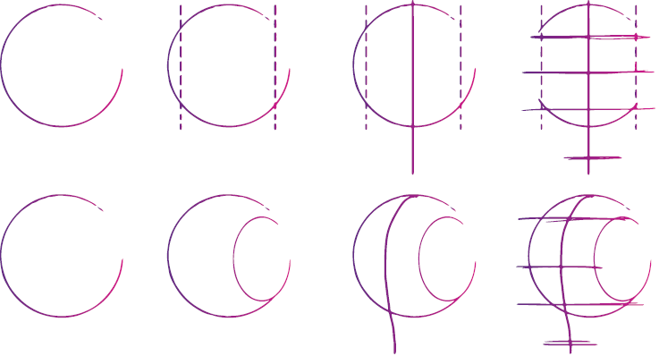
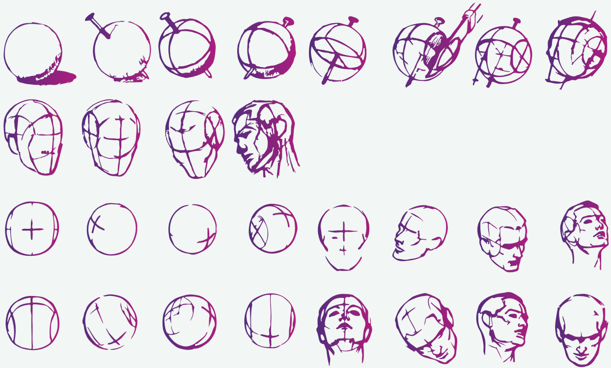

### Proporções do rosto

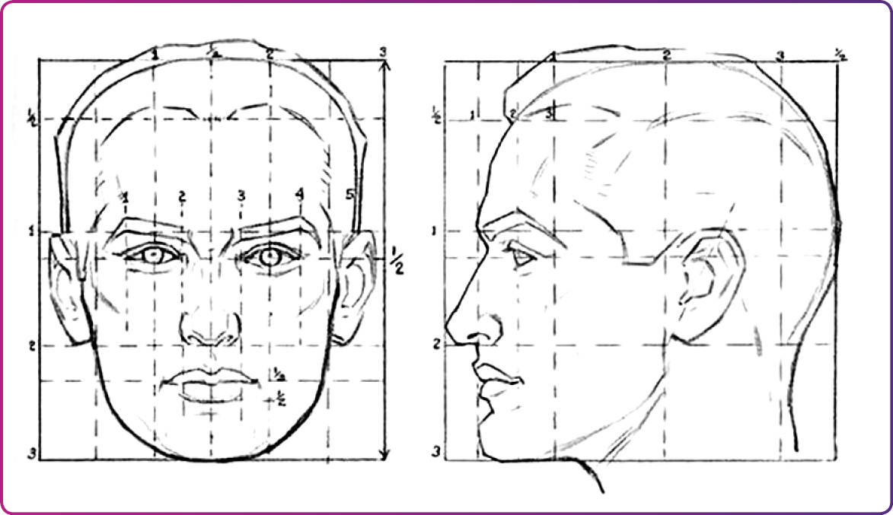

Referências para elementos do rosto

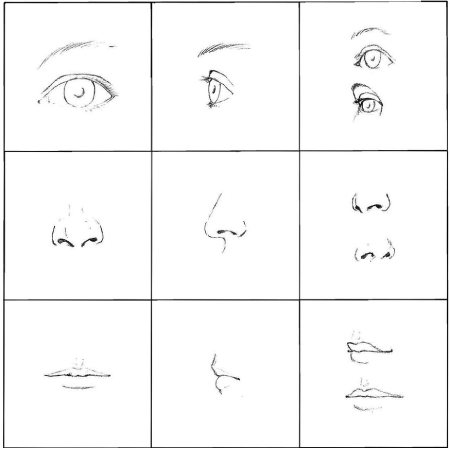
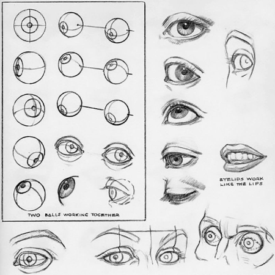
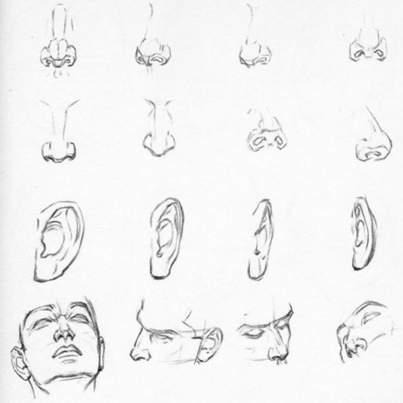
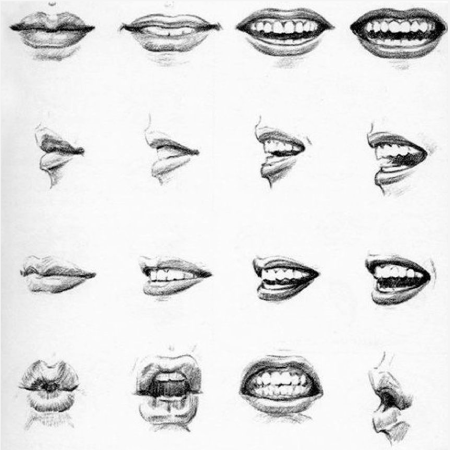

## Cabelo

- É difícil de estabelecer um padrão canônico para o cabelo, que varia demais.

### 3 formas de Hallawell para observar o cabelo

- A partir da luz incidente sobre a cabeça, que revela a massa geral do cabelo.
- A partir das mechas que são reveladas nos conjuntos de fios, a volumetria de cada uma, suas partes iluminadas e sombreadas.
- Os fios que serão desenhados na finalização.

Processo para desenhar cabelo

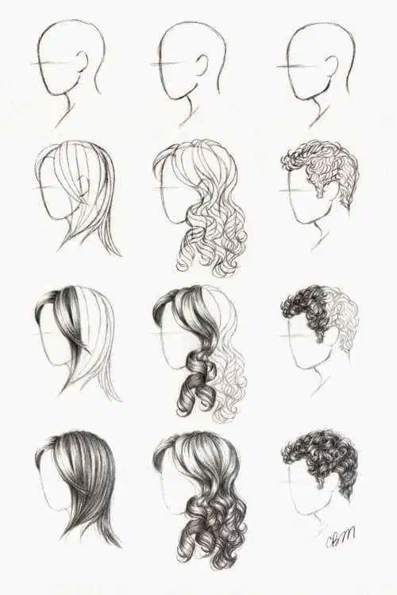
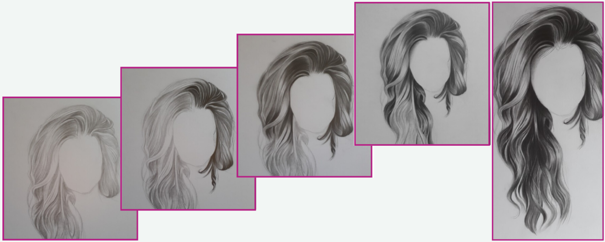

## O corpo humano

- O método mais usado é a referência por cabeças.

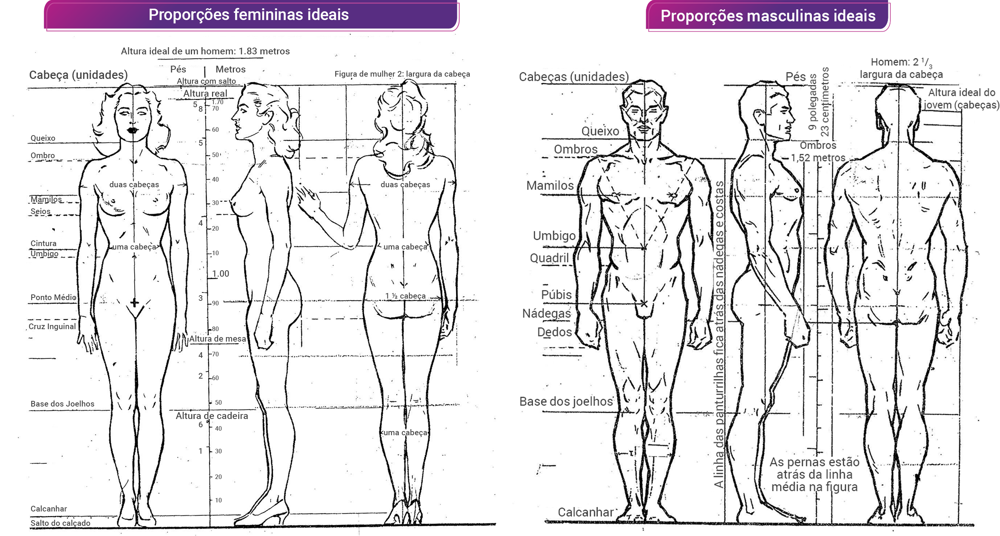

### Figura humana em movimento

- É necessário considerar as articulações, o ponto de apoio e a linha de ação.

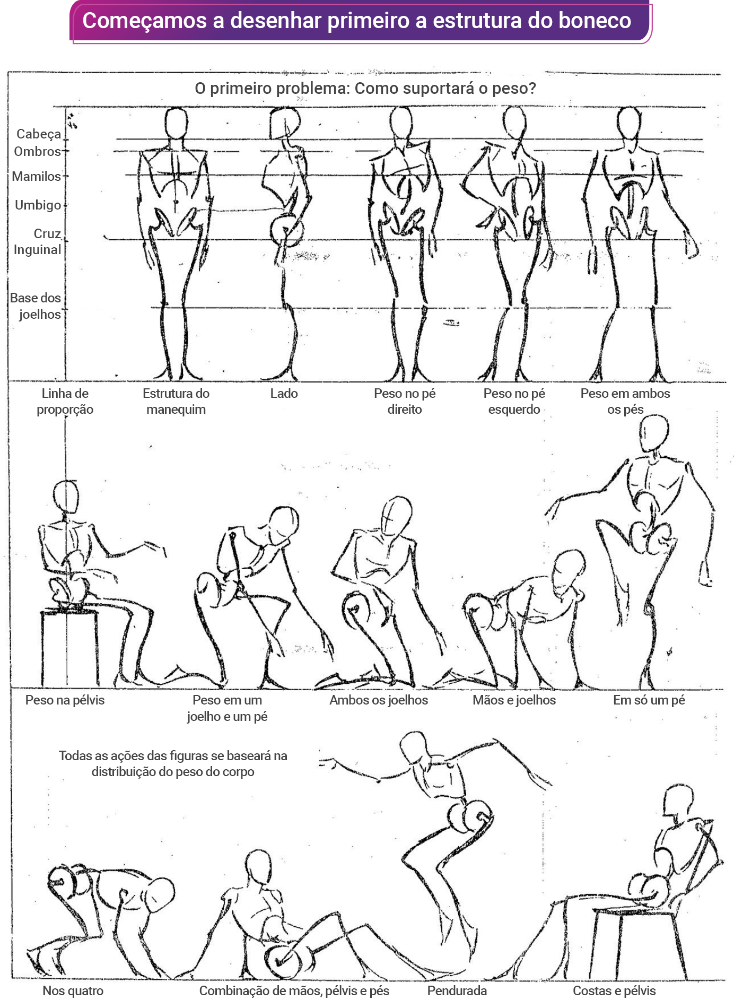

### Escorço

- Deriva do verbo italiano **scorciare**, que significa "encurtar".
- técnica de representação utilizada em desenho, na qual uma forma, objeto, coisa ou figura é desenhado “imaginando dentro de uma caixa”.
- O desenho dessa caixa, no entanto, é perspetivado (em perspectiva).

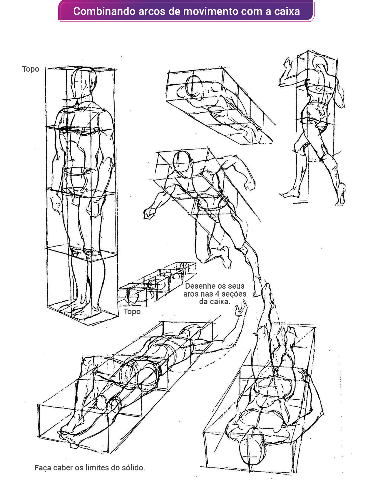

### Simplificação da figura humana

- Na arquitetura e moda, é comum desenhar a figura humana sem muitos detalhes, apenas o necessário para compreensão do contexto.

- Os cânones clássicos servem de base de construção, mas o designer, após os seus desenhos conceituais, que o guiarão em suas ideias, deve perceber o outro, deve compreender a proporção corpórea do usuário e estudá-la para ajustar sua criação com a intenção de fornecer conforto, beleza e equilíbrio de forma.
- O desenho de moda é a oportunidade de desenhar o corpo humano de acordo com o que é bem-aceito em seu tempo.
- A insatisfação com proporções, características, etnia, talvez não tão bem-aceitas socialmente dentro de uma cultura, encontra no desenho a chance de construção de um corpo com medidas perfeitas, definidas no momento de sua concepção.

